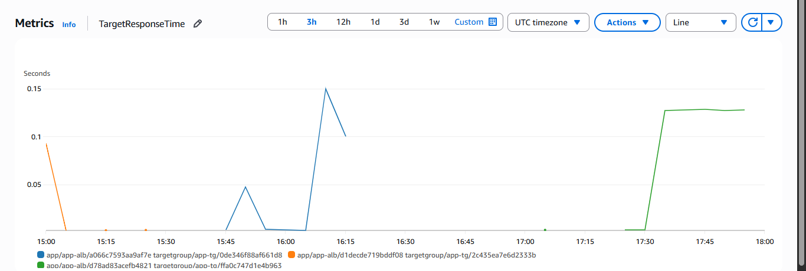

# Baseline Performance Report

## Test Config
- ALB URL: http://app-alb-1292617256.eu-west-3.elb.amazonaws.com/items?count=10
- Steady Test: 10 VUs for 10 min
- Spike Test: 50 VUs for 60 sec

## Steady Test Results
- Total Requests: 24126
- Errors: 0
- Error Rate: 0.00%
- p50 Latency: 245.83 ms
- p95 Latency: 338.48 ms

## Spike Test Results
- Total Requests: 9863
- Errors: 0
- Error Rate: 0.00%
- p50 Latency: 281.25 ms
- p95 Latency: 546.38 ms

## Notes
- Attach CloudWatch screenshots manually for ASG behavior.
EC2 CPU Utilization

ALB Target Response

ALB HTTPCode_ELB_4XX_Count
