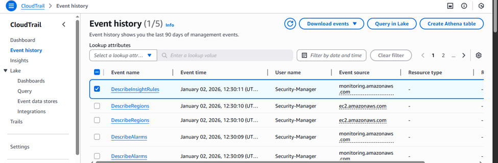
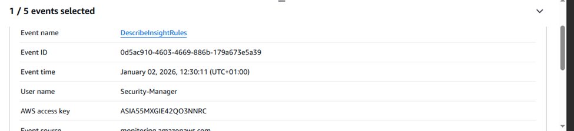

# Governance Evidence Report

## CloudTrail
After enabling cloudtrail we can successfully track "who did what" in the event history as next

## AWS Config
We enable Aws config.

we edit our S3 bucket to be public temporarily AWS config catches the public S3 bucket as a non-compliance service, and it will be visible in the dashboard.

Only then we start the remediation and the service will be once again compliant